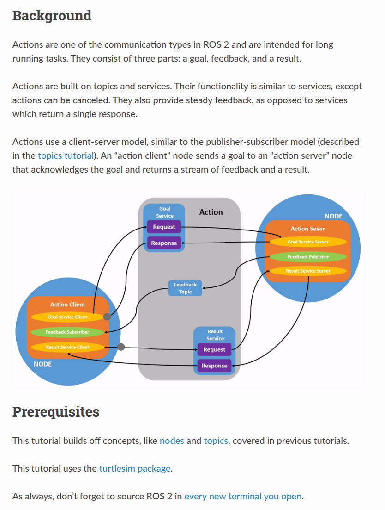

## navigation

1. perception
2. decision making
3. control

decision making 
1. path planning
2. path following

action servers

Action sever : used communivate with BT through NvaigateToPose action message.

Lifecycle : inactive by configure => activate node 

on_configure() 

on_activate()

deactivate, cleaning up, shut down, end 

# Nav2 Action server

1. planner
2. behavior
3. smoother
4. controller servers

it follows a reference path. In this case, then all parameters for DWB would be placed in that namespace, e.g. FollowPath.<param>.

동작 서버 호출, 동작 서버 콜맥 Followpath 매핑되는 알고리즘 호출.

# Planner 

task of a planner : compute a path to complete some objective function

2 canonical examples 

- current position => goal
- complete coverage ( cover all free space)

1. compute shortest path
2. compute complete coverage path
3. compute paths along sparse or predefined routes

# Controllers

follow path

# behavior (복구동작)

실패 조건 처리, 자율적 처리, cost map recover

stuck in obstacles => escape to free space => slack, SMS, ..

# smoother

# robot foot print

# waypoint follow 

nav2_waypoint_follower

# state estimate

map 변환, odom 위치 지정 시스템(localization, mapping, slam)

rep-105

https://www.ros.org/reps/rep-0105.html

좌료 프레임
- base_link라는 좌표 프레임은 모바일 로봇 베이스에 단단히 부착됨.

 REP-105는 최소한 로봇에 대한 전체 map-> odom-> base_link-> 를 포함하는 TF 트리를 만들어야 한다

# global positioning : localization & slam

map -> odom 변환 제공.

 amcl : static map에서 위치 파악하기 위한 particle filter에 기반한 adaptive monte carlo localization 

# odometry 

odom -> base_link
로봇 모션을 기반으로 부드럽고 연속적인 로컬 프레임 제공.

